# AWS Serverless Assignments (Low Cost & Easy to Complete)

## Completed Assignments

1. Automated S3 Bucket Cleanup
2. Automated EBS Snapshot Creation and Cleanup
3. Daily AWS Cost Alert Using Cost Explorer API and SNS
4. Audit S3 Buckets for Public Access and Notify

These four assignments demonstrate AWS serverless automation using Lambda, EventBridge, SNS, S3, Cost Explorer and EBS services while keeping AWS costs minimal.

---

# Assignment 1: Automated S3 Bucket Cleanup

## Architecture
S3 Bucket -> Lambda -> Deletes Old Objects

## Important Screenshots and Files
1. S3 bucket created and Files uploaded
2. IAM Role permissions
3. Lambda test execution result
4. Invoke Lambda manually
5. Bucket after cleanup

## Create S3 Bucket
- Open S3
- Create bucket: mab-s3-cleanup-demo
- Upload 3-5 test files
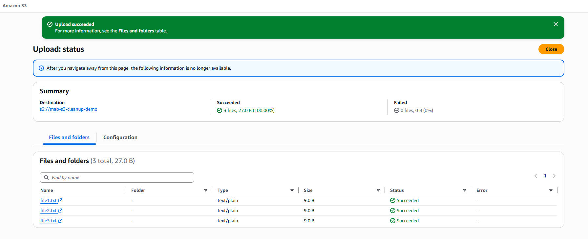

## Create IAM Role
Policy:
- s3:ListBucket
- s3:DeleteObject
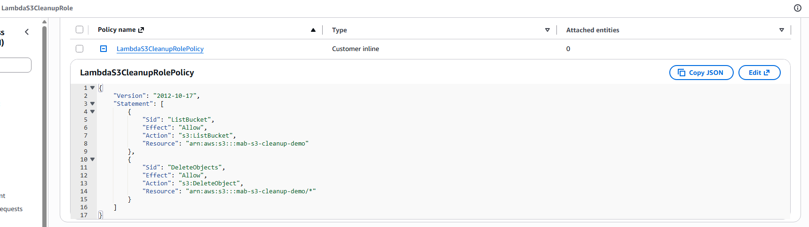

## Create Lambda
Runtime: Python 3.12
Environment Variable: BUCKET_NAME=mab-s3-cleanup-demo

## Lambda Code
```python
import boto3
from datetime import datetime, timezone, timedelta

s3 = boto3.client('s3')

BUCKET_NAME = 'mab-s3-cleanup-demo'
DAYS = 30


def lambda_handler(event, context):
    cutoff = datetime.now(timezone.utc) - timedelta(days=DAYS)

    paginator = s3.get_paginator('list_objects_v2')

    deleted = []

    for page in paginator.paginate(Bucket=BUCKET_NAME):
        for obj in page.get('Contents', []):
            if obj['LastModified'] < cutoff:
                s3.delete_object(
                    Bucket=BUCKET_NAME,
                    Key=obj['Key']
                )
                deleted.append(obj['Key'])
                print(f'Deleted: {obj["Key"]}')

    return {
        'deleted_objects': deleted
    }
```

## Testing
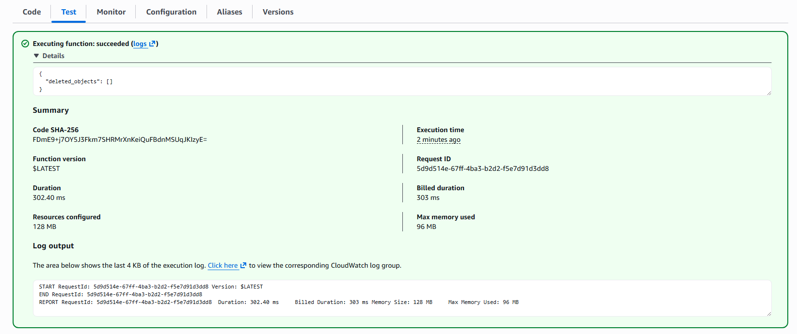
Use minutes instead of 30 days temporarily.
Invoke Lambda manually.
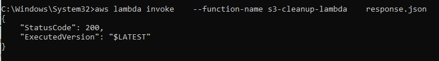
Verify old files removed.
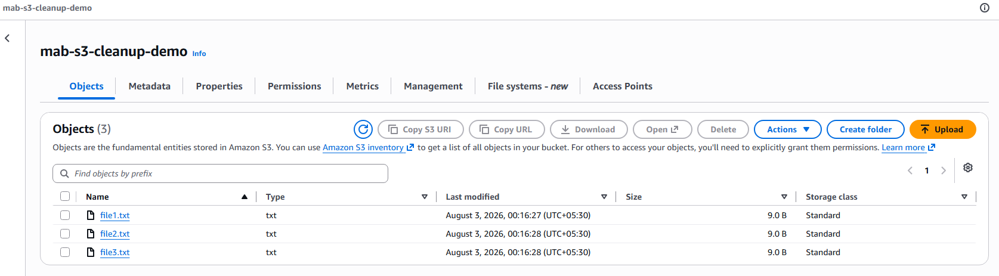
## Discussion
S3 Lifecycle Rules are preferred for simple expiration. Lambda is useful when deletion depends on naming patterns, metadata, approval checks, notifications, or cross-service actions.

---

# Assignment 2: Automated EBS Snapshot Creation and Cleanup

## Important Screenshots
1. EBS Volume ID
2. IAM Role Permission
3. Lambda test execution result
4. Invoke Lambda manually
5. Snapshot created
6. EventBridge schedule

## Create Volume
Use root volume of existing EC2.
Note Volume ID. That is vol-0cadd439219dddbaf
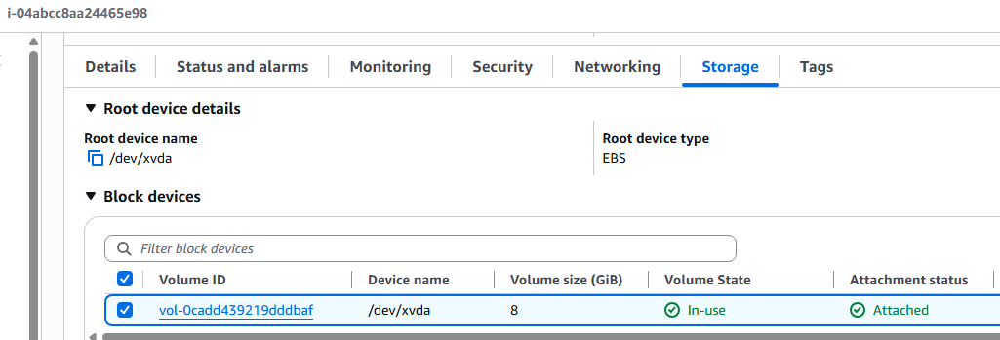

## IAM Role
Permissions:
- ec2:CreateSnapshot
- ec2:DescribeSnapshots
- ec2:DeleteSnapshot
- ec2:CreateTags
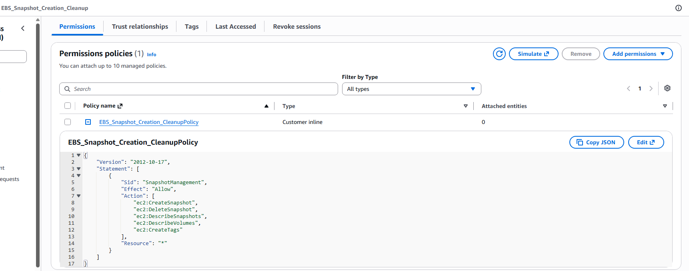

## Lambda
Runtime Python 3.12

## Lambda Code
```python
import boto3
from datetime import datetime, timezone, timedelta

ec2 = boto3.client('ec2')
VOLUME_ID = 'vol-0cadd439219dddbaf'

def lambda_handler(event, context):

    snapshot = ec2.create_snapshot(
        VolumeId=VOLUME_ID,
        Description='Lambda Backup Snapshot'
    )

    snapshot_id = snapshot['SnapshotId']

    ec2.create_tags(
        Resources=[snapshot_id],
        Tags=[{'Key':'CreatedBy','Value':'Lambda-Backup'}]
    )

    print('Created:', snapshot_id)

    retention = datetime.now(timezone.utc) - timedelta(minutes=5)

    snapshots = ec2.describe_snapshots(
        OwnerIds=['self'],
        Filters=[
            {
                'Name':'tag:CreatedBy',
                'Values':['Lambda-Backup']
            }
        ]
    )

    for snap in snapshots['Snapshots']:
        if snap['StartTime'] < retention:
            ec2.delete_snapshot(
                SnapshotId=snap['SnapshotId']
            )
            print('Deleted:', snap['SnapshotId'])

    return {'snapshot': snapshot_id}
```


## Testing
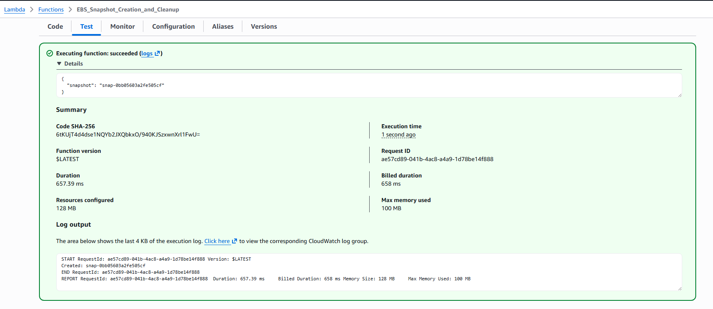
Run Lambda manually.
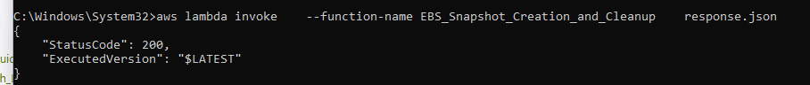
Check EC2 -> Snapshots.
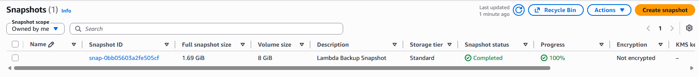

## EventBridge Schedule
Schedule: One time schedule
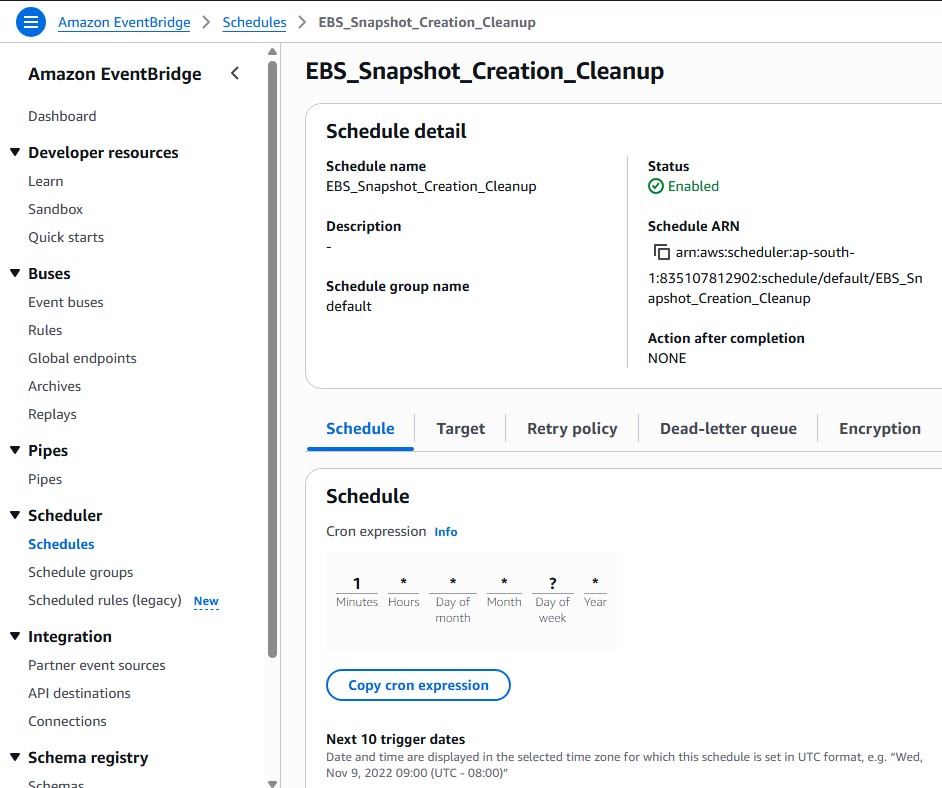

## Discussion
AWS DLM is preferred for basic retention. Lambda is better for custom retention logic, cross-account copies, Teams/Email alerts and business rules.

---

# Assignment 4: Daily AWS Cost Alert Using Cost Explorer and SNS

## Important Screenshots
1. SNS Topic Created
2. Email Subscription Confirmed
3. IAM Role Permissions
4. Test Event Execution
5. CloudWatch Logs
6. SNS Email Alert Received
7. EventBridge Schedule

## Create SNS Topic
Open: AWS Console → SNS → Topics
Create Topic: aws-cost-alert
Type: Standard

## Create Email Subscription
Inside Topic: Create Subscription
Protocol: Email
Endpoint: mueen.ab@gmail.com
Click: Create Subscription
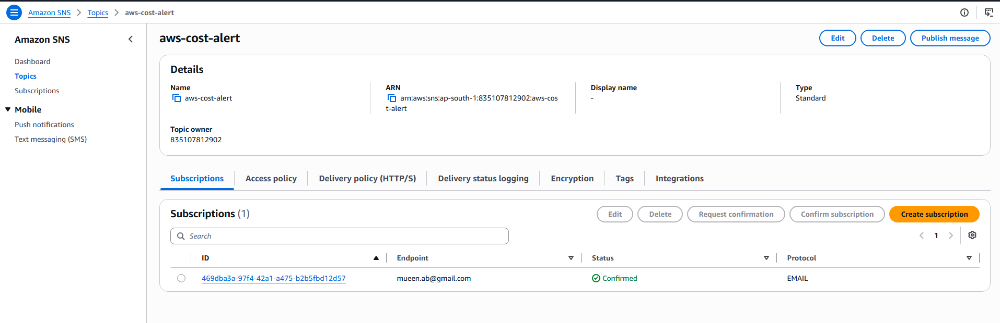
Check email and click: Confirm Subscription
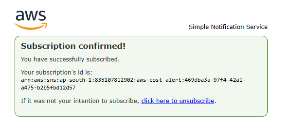

## Create IAM Role
Open: IAM → Roles → Create Role
Trusted Entity: Lambda
Role Name: Lambda-Cost-Alert

## IAM Permissions
Attach Managed Policy: AWSLambdaBasicExecutionRole
Inline Permissions: 
- ce:GetCostAndUsage
- sns:Publish
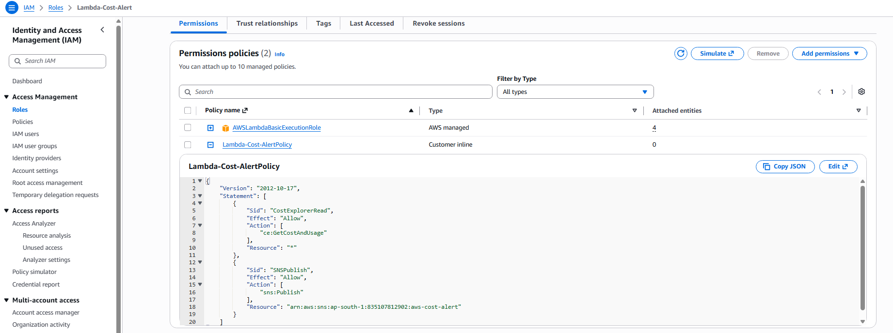
Note: AWSLambdaBasicExecutionRole was attached to allow CloudWatch log creation.

## Create Lambda Function

Function Name: daily-cost-alert

Runtime: Python 3.12

Execution Role: Lambda-Cost-Alert

## Lambda Code
```python
import boto3
import os
from datetime import date

sns = boto3.client('sns')
ce = boto3.client('ce', region_name='us-east-1')

TOPIC_ARN = os.environ['TOPIC_ARN']
THRESHOLD = float(os.environ['THRESHOLD'])

def lambda_handler(event, context):

    start = date.today().replace(day=1).strftime('%Y-%m-%d')
    end = date.today().strftime('%Y-%m-%d')

    response = ce.get_cost_and_usage(
        TimePeriod={
            'Start': start,
            'End': end
        },
        Granularity='MONTHLY',
        Metrics=['UnblendedCost']
    )

    amount = float(
        response['ResultsByTime'][0]
        ['Total']['UnblendedCost']['Amount']
    )

    print(f"Current AWS Spend: ${amount}")

    if amount > THRESHOLD:

        sns.publish(
            TopicArn=TOPIC_ARN,
            Subject="AWS Cost Alert",
            Message=f"Current AWS spend is ${amount}"
        )

        print("Alert Sent")

    return {
        'current_cost': amount
    }
```

## Environment Variables
TOPIC_ARN=arn:aws:sns:ap-south-1:835107812902:aws-cost-alert
THRESHOLD=0.01

## EventBridge Schedule
rate(1 day)
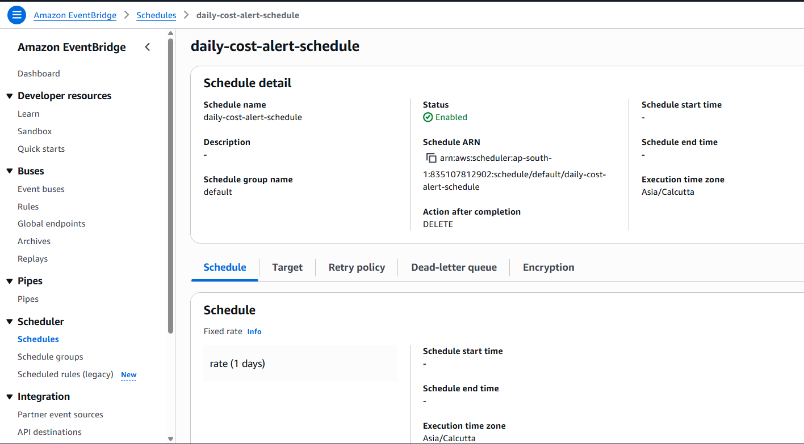
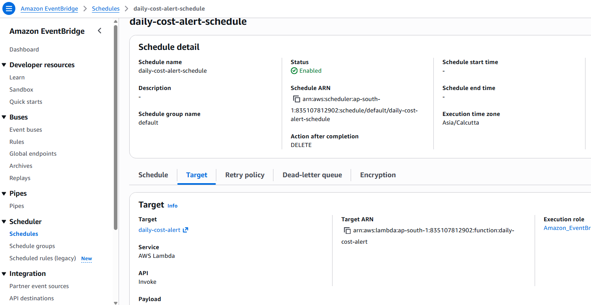
This explains the Scheduler role screenshot.

## Testing
1. Deploy Lambda
2. Create test event {}
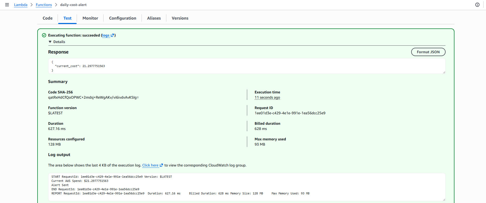
3. Run Lambda manually
4. Verify CloudWatch logs generated.
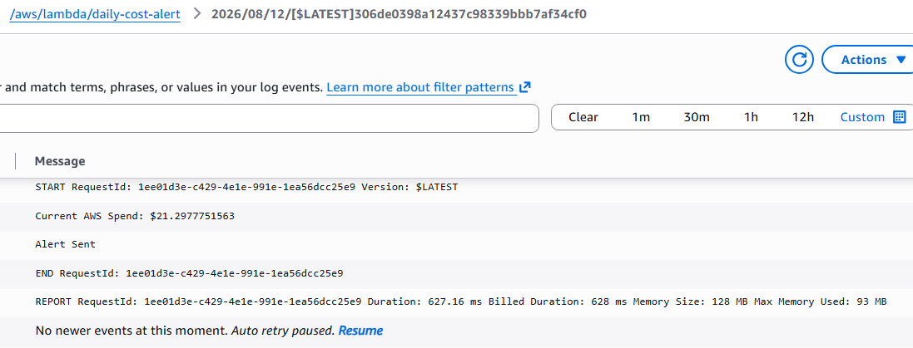
5. Verify SNS email received
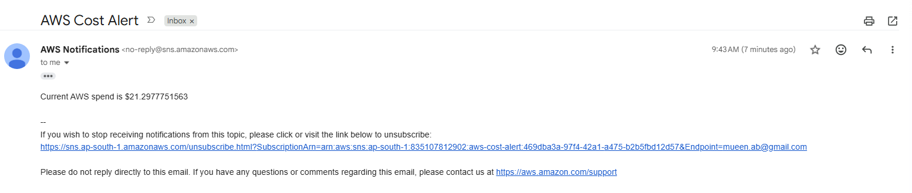

## Cleanup
Delete:
- Lambda Function
- EventBridge Schedule
- SNS Topic

## Discussion
AWS Budgets is the managed solution. Lambda is preferred when custom thresholds, Slack/Teams integration, anomaly detection or service-wise analysis is required.

---
# Assignment 6: Audit S3 Buckets for Public Access and Notify

## Architecture
S3 Buckets -> Lambda -> SNS -> Email Alert

## Important Screenshots
1. Test S3 Bucket Created with Block Public Access Disabled and Bucket Policy
2. SNS Topic and Email Subscription Confirmed and Email Confirmation
3. IAM Role Permissions
4. Test Execution Result
5. CloudWatch Logs
6. SNS Email Alert Received
7. EventBridge Schedule

## Create SNS Topic
Name: s3-public-alert
Type: Standard
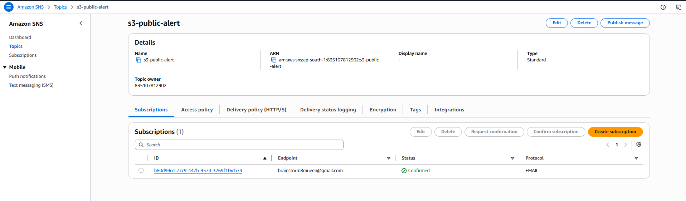
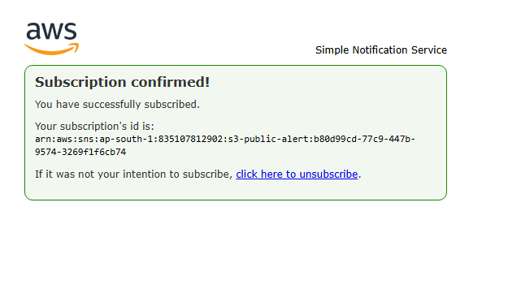

## Create Test Bucket
Create a test bucket.
Disable Block Public Access.
Apply temporary public-read policy.
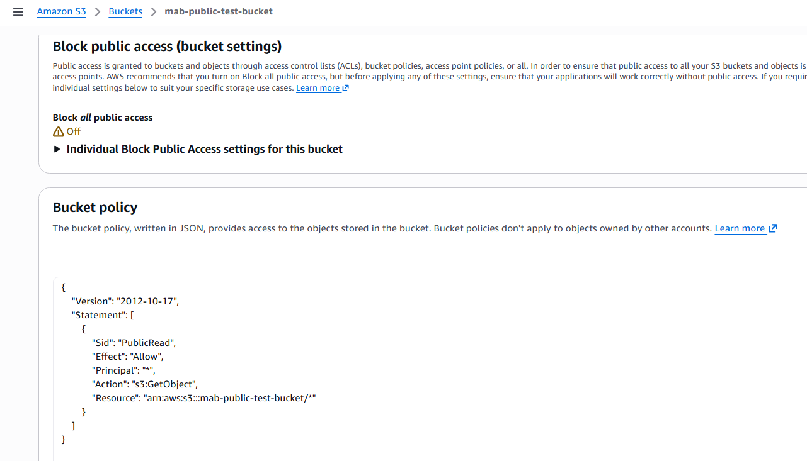

## Create IAM Role
Role Name: Lambda-S3-Audit

Attach Managed Policy:
- AWSLambdaBasicExecutionRole

Inline Permissions:
- s3:ListAllMyBuckets
- s3:GetBucketPublicAccessBlock
- s3:GetBucketPolicyStatus
- s3:GetBucketAcl
- sns:Publish
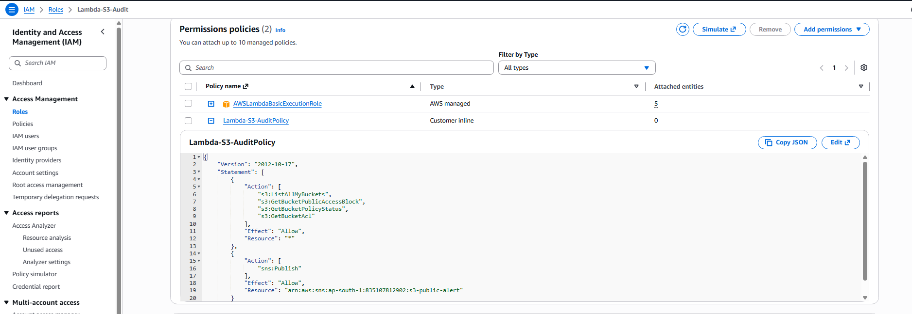
Note: AWSLambdaBasicExecutionRole was attached to allow CloudWatch log creation.

## Create Lambda Function
Function Name: audit-public-s3
Runtime: Python 3.12
Execution Role:
Lambda-S3-Audit

## Lambda Code
```python
import boto3
import os

s3 = boto3.client('s3')
sns = boto3.client('sns')

TOPIC_ARN = os.environ['TOPIC_ARN']

def lambda_handler(event, context):

    findings = []

    buckets = s3.list_buckets()['Buckets']

    for bucket in buckets:

        bucket_name = bucket['Name']

        try:

            policy = s3.get_bucket_policy_status(
                Bucket=bucket_name
            )

            if policy['PolicyStatus']['IsPublic']:
                findings.append(
                    f"{bucket_name} - Public Policy"
                )

        except Exception:
            pass

        try:

            block = s3.get_public_access_block(
                Bucket=bucket_name
            )

            config = block[
                'PublicAccessBlockConfiguration'
            ]

            if not all(config.values()):
                findings.append(
                    f"{bucket_name} - Public Access Block Disabled"
                )

        except Exception:
            findings.append(
                f"{bucket_name} - No Public Access Block Found"
            )

    if findings:

        message = "\n".join(findings)

        sns.publish(
            TopicArn=TOPIC_ARN,
            Subject="S3 Public Bucket Alert",
            Message=message
        )

        print(message)

        return {
            'findings': findings
        }

    print("No Public Buckets Found")

    return {
        'status': 'Secure'
    }
```
## Lambda Function Configuration:
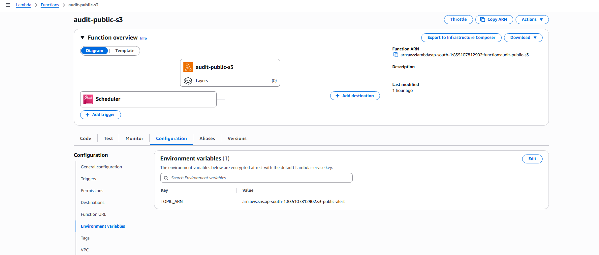   

## Environment Variables
TOPIC_ARN=arn:aws:sns:ap-south-1:835107812902:s3-public-alert

## EventBridge Schedule
rate(1 day)
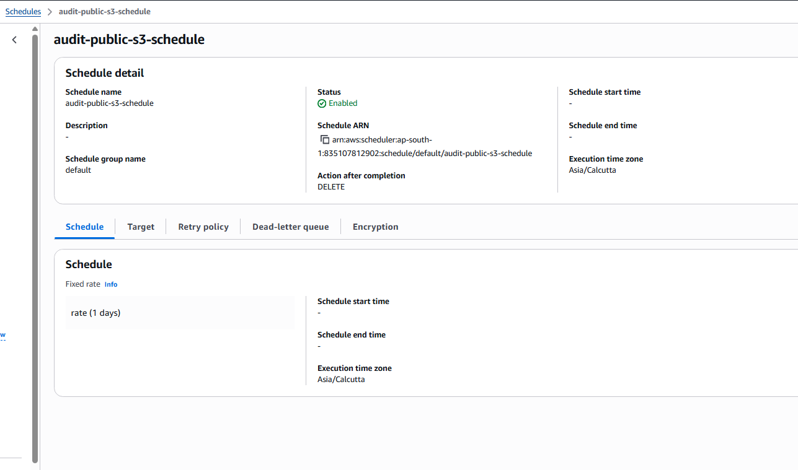
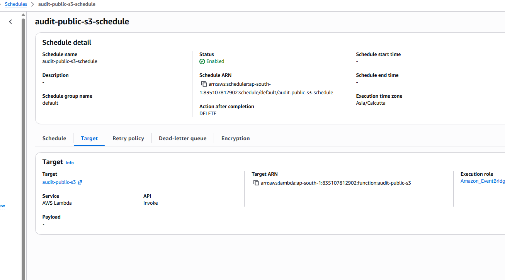

## Testing
1. Run Lambda manually
2. Verify public bucket detected
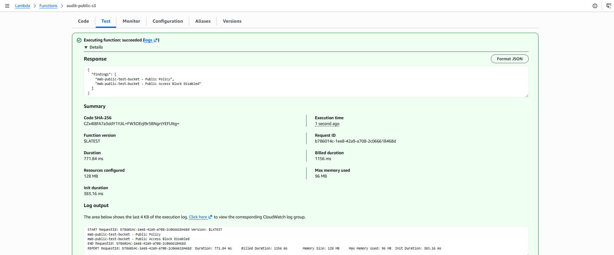
3. Verify SNS email received
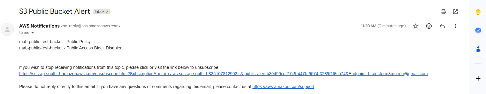
4. Verify CloudWatch logs
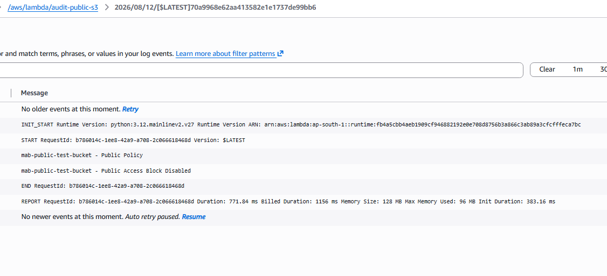
5. Re-enable Block Public Access
6. Remove public policy
7. Delete test bucket

## Cleanup
- Re-enable Block Public Access
- Remove Public Bucket Policy
- Delete Test Bucket
- Delete Lambda Function
- Delete EventBridge Schedule
- Delete SNS Topic

## Discussion
AWS Config and Security Hub provide managed compliance monitoring. Lambda is useful when custom compliance checks, automated remediation, ticket creation or notification workflows are required.

---

# Submission Checklist

## Assignment 1
- Bucket Created
- Files Uploaded
- Lambda Executed
- Old Files Deleted

## Assignment 2
- Snapshot Created
- Snapshot Tagged
- Cleanup Tested
- EventBridge Added

## Assignment 4
- SNS Topic Created
- Email Subscription Confirmed
- IAM Role Created
- Lambda Executed Successfully
- Cost Explorer API Working
- CloudWatch Logs Captured
- SNS Alert Email Received
- EventBridge Schedule Added

## Assignment 6
- Test Bucket Created
- Public Policy Applied
- Block Public Access Disabled
- SNS Topic Created
- Email Subscription Confirmed
- IAM Role Created
- Lambda Executed Successfully
- Public Bucket Detected
- CloudWatch Logs Captured
- SNS Alert Email Received
- EventBridge Schedule Added
- Bucket Re-Secured and Deleted

---

# Cost Optimization

Use:
- Free Tier S3
- Existing EC2 Volume
- t3.micro
- Lambda Free Tier
- SNS Free Tier
- EventBridge Free Tier

Delete test resources after screenshots are taken.