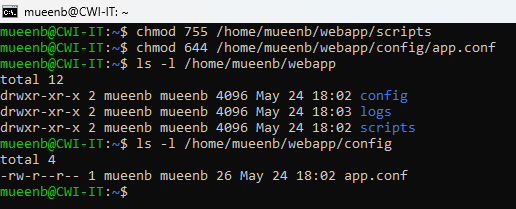
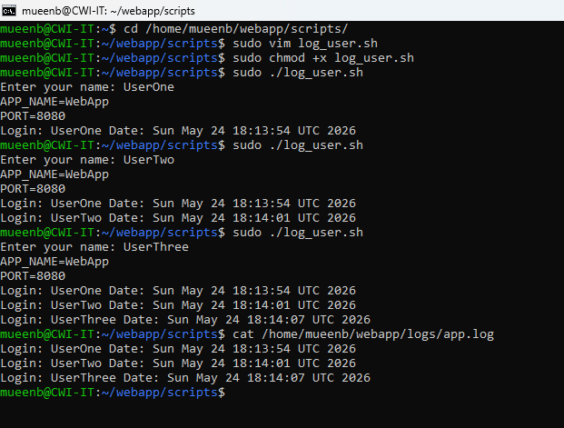

🔹🔹🔹🔹🔹🔹🔹🔹🔹🔹🔹🔹🔹🔹🔹🔹🔹🔹🔹🔹🔹🔹🔹🔹🔹🔹🔹🔹🔹🔹🔹🔹🔹🔹🔹🔹🔹🔹🔹🔹🔹🔹🔹🔹🔹🔹
# 🧩 Testing, Linux and Server Assessment
__________________________________________________________________________________________________________________

## 📌 Overview
This project demonstrates:
- Creation of Linux directory structure
- File permissions and ownership management
- Interactive Bash scripting
- User and group access control

## 📁 Testing_Linux_and_Server_Assessment_24052026
```bash
.
├── README.md
webapp/
│   └── app.conf
├── config/
│   └── app.conf
├── logs/
│   └── app.log
├── scripts/
│   └── log_user.sh
└── images
│   └── *.png
```

## 🚀 Getting Started

### 🔁 Clone the Repository
```terminal
git clone https://github.com/brainstorm8mueen/repo4hv.git
cd .\UploadedAssignment\
mkdir Testing_Linux_and_Server_Assessment_24052026
cd 
touch README.md
```

```
connected to WSL in command prompt
```
wsl -d Ubuntu
cd
```
__________________________________________________________________________________________________________________
## ✅ Assessment Tasks Covered
------------------------------------------------------------------------------------------------------------------
## 🎯 **Question 1: Set Up Your DevOps Project Structure**

🧠 **Objective**
Create a complete project directory from scratch, apply correct permissions, and set ownership. The structure you build here will be used directly by your script in Question 2.

🔎 **Scenario**


🧪 **Tasks**

#### **:one:	Create the directory /home/ec2-user/webapp/ with three subdirectories inside it: scripts/, logs/, and config/ using a single mkdir -p command.**
```terminal
mkdir -p /home/mueenb/webapp/{scripts,logs,config}
```


#### **:two:	Use cat > to create config/app.conf with two lines of content: APP_NAME=WebApp and PORT=8080. Save using Ctrl+D.**
```terminal
cat > /home/mueenb/webapp/config/app.conf
```
Type the following content:
```app.conf
APP_NAME=WebApp
PORT=8080
```
Save file using: Ctrl + D


#### **:three:	Use touch to create an empty file at logs/app.log. Confirm it is 0 bytes using ls -l.**
```terminal
touch /home/mueenb/webapp/logs/app.log
ls -l /home/mueenb/webapp/logs/
```


#### **:four: Set permissions: chmod 755 scripts/ and chmod 644 config/app.conf. Explain in your own words what 755 and 644 mean for owner, group, and others.**
```terminal
chmod 755 /home/mueenb/webapp/scripts
chmod 644 /home/mueenb/webapp/config/app.conf
```
```
🔐 Permission Explanation
🔸 755 (for directories like scripts/)

Owner: rwx → Full access (read, write, execute)
Group: r-x → Read + execute only
Others: r-x → Read + execute only

👉 Meaning: Only owner can modify, others can only access/run.

🔸 644 (for files like app.conf)

Owner: rw- → Read + write
Group: r-- → Read only
Others: r-- → Read only

👉 Meaning: Only owner can edit file, others can read.
```


#### **:five:	Recursively change ownership of the entire webapp/ directory to root:root using chown -R. Then run ls -lR /home/ec2-user/webapp/ and share the output to confirm every file and folder shows root root as owner.**
```terminal
sudo chown -R root:root /home/mueenb/webapp/
ls -lR /home/mueenb/webapp/
```

------------------------------------------------------------------------------------------------------------------

## 🎯 **Question 2: Write an Interactive Log Script**

🧠 **Objective**
Using the webapp/ structure from Question 1, write a bash script that takes user input, reads a config file, and writes timestamped log entries. The log entries you create here will be the input for Question 3.

🔎 **Scenario**


🧪 **Tasks**

#### **:one:	Create a new script file at /home/ec2-user/webapp/scripts/log_user.sh using vim. Start with the correct shebang line.**
```terminal
cd /home/mueenb/webapp/scripts/
sudo vim log_user.sh
```

#### **:two:	Check what changes are made before staging**
```log_user.sh
#!/bin/bash
read -p "Enter your name: " username
cat /home/mueenb/webapp/config/app.conf
echo "Login: $username Date: $(date)" >> /home/mueenb/webapp/logs/app.log
cat /home/mueenb/webapp/logs/app.log
```

#### **:three:	View differences in the file**
```terminal
sudo chmod +x log_user.sh
sudo ./log_user.sh
```


------------------------------------------------------------------------------------------------------------------
## 🎯 **Question 3: User Management and File Permission Control**

🧠 **Objective**
Create 4 Linux users. Two of them must have write access to the log_user.sh script created in Question 2, and the other two must have read-only access. Use Linux groups and chmod to control this.

🔎 **Scenario**


🧪 **Tasks**

#### **:one:	**
```terminal

```
#### **:two:	**
```terminal

```
#### **:three:	**
```

```

#### **:four:	**
```terminal

```

#### **:five:    **
```terminal

```

#### **:six:	**
```terminal

```

#### **:seven:	**
```terminal

```


__________________________________________________________________________________________________________________

## 🛠️  Commands Used
```bash

```

__________________________________________________________________________________________________________________

## 📚 Technologies Used
- 

__________________________________________________________________________________________________________________

## 👤 Author
**Mueen Aziz Bhombal**  
Senior IT Engineer

__________________________________________________________________________________________________________________

## 📝 Notes
- This repository is created for **learning and assessment purposes**.
- Commit messages follow best practices for clarity and traceability.

🔹🔹🔹🔹🔹🔹🔹🔹🔹🔹🔹🔹🔹🔹🔹🔹🔹🔹🔹🔹🔹🔹🔹🔹🔹🔹🔹🔹🔹🔹🔹🔹🔹🔹🔹🔹🔹🔹🔹🔹🔹🔹🔹🔹🔹🔹
