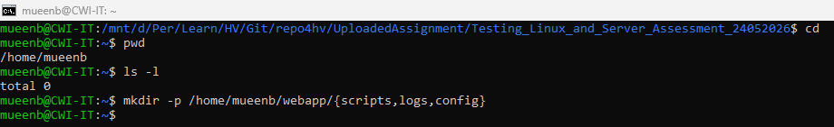
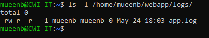
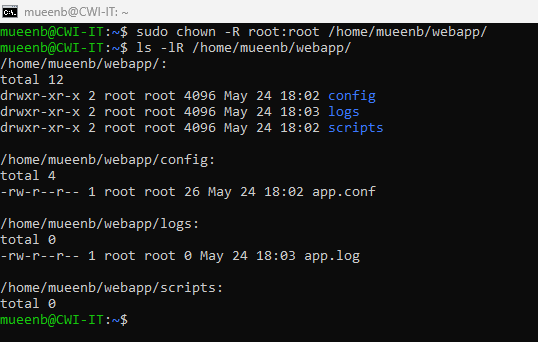
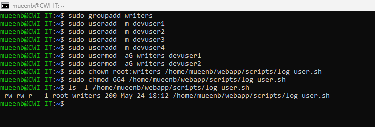

🔹🔹🔹🔹🔹🔹🔹🔹🔹🔹🔹🔹🔹🔹🔹🔹🔹🔹🔹🔹🔹🔹🔹🔹🔹🔹🔹🔹🔹🔹🔹🔹🔹🔹🔹🔹🔹🔹🔹🔹🔹🔹🔹🔹🔹🔹
# 🧩 Testing, Linux and Server Assessment
__________________________________________________________________________________________________________________

## 📌 Overview
This assignment builds a connected workflow across three questions:
1. Create a standard project structure with correct files, permissions, and ownership.
2. Write an interactive Bash script that reads config and appends timestamped logs.
3. Manage Linux users and enforce read/write access using groups + chmod.

## 📁 Testing_Linux_and_Server_Assessment_24052026
```bash
images
└── *.png
webapp/
├── config/
│   └── app.conf
├── logs/
│   └── app.log
├── scripts/
│   └── log_user.sh
README.md
```

## 🚀 Getting Started

### 🔁 Clone the Repository
```terminal
git clone https://github.com/brainstorm8mueen/repo4hv.git
cd .\UploadedAssignment\
mkdir Testing_Linux_and_Server_Assessment_24052026
cd 
touch README.md
```

Connected to WSL in command prompt
```terminal
wsl -d Ubuntu
cd 
```
**Note: Thanks to this question, we learned that in WSL, the /mnt drive has 777 permissions that cannot be changed. Therefore, we need to move to the distribution's home directory to work with permissions.**

__________________________________________________________________________________________________________________
## ✅ Assessment Tasks Covered
------------------------------------------------------------------------------------------------------------------
## 🎯 **Question 1: Set Up Your DevOps Project Structure**

🧠 **Objective**
Create a complete project directory from scratch, apply correct permissions, and set ownership. The structure you build here will be used directly by your script in Question 2.

🔎 **Scenario**
You are setting up a production-style folder layout for a small web application.  
- `scripts/` will store automation scripts  
- `config/` holds app configuration  
- `logs/` stores runtime logs  
To standardize and secure the system, you must enforce correct permission

🧪 **Tasks**

#### **:one:	Create the directory /home/ec2-user/webapp/ with three subdirectories inside it: scripts/, logs/, and config/ using a single mkdir -p command.**
```terminal
mkdir -p /home/mueenb/webapp/{scripts,logs,config}
```


#### **:two:	Use cat > to create config/app.conf with two lines of content: APP_NAME=WebApp and PORT=8080. Save using Ctrl+D.**
```terminal
cat > /home/mueenb/webapp/config/app.conf
```
Type the following content:
```app.conf
APP_NAME=WebApp
PORT=8080
```
Save file using: Ctrl + D


#### **:three:	Use touch to create an empty file at logs/app.log. Confirm it is 0 bytes using ls -l.**
```terminal
touch /home/mueenb/webapp/logs/app.log
ls -l /home/mueenb/webapp/logs/
```


#### **:four: Set permissions: chmod 755 scripts/ and chmod 644 config/app.conf. Explain in your own words what 755 and 644 mean for owner, group, and others.**
```terminal
chmod 755 /home/mueenb/webapp/scripts
chmod 644 /home/mueenb/webapp/config/app.conf
```
```
🔐 Permission Explanation
🔸 755 (for directories like scripts/)

Owner: rwx → Full access (read, write, execute)
Group: r-x → Read + execute only
Others: r-x → Read + execute only

👉 Meaning: Only owner can modify, others can only access/run.

🔸 644 (for files like app.conf)

Owner: rw- → Read + write
Group: r-- → Read only
Others: r-- → Read only

👉 Meaning: Only owner can edit file, others can read.
```


#### **:five:	Recursively change ownership of the entire webapp/ directory to root:root using chown -R. Then run ls -lR /home/ec2-user/webapp/ and share the output to confirm every file and folder shows root root as owner.**
```terminal
sudo chown -R root:root /home/mueenb/webapp/
ls -lR /home/mueenb/webapp/
```

------------------------------------------------------------------------------------------------------------------

## 🎯 **Question 2: Write an Interactive Log Script**

🧠 **Objective**
Using the webapp/ structure from Question 1, write a bash script that takes user input, reads a config file, and writes timestamped log entries. The log entries you create here will be the input for Question 3.

🔎 **Scenario**
You are asked to create a basic login tracking utility for operations.
Each time a user runs the script, it should:
Ask their name
Display app config (so operator confirms settings)
Write a timestamped login record into the log file
This log file will later be used for permission testing in Question 3.

🧪 **Tasks**

#### **:one:	Create a new script file at /home/ec2-user/webapp/scripts/log_user.sh using vim. Start with the correct shebang line.**
```terminal
cd /home/mueenb/webapp/scripts/
sudo vim log_user.sh
```

#### **:two:	Use read -p to prompt the user to enter their name and store it in a variable called username.**
#### **:three:	Use cat with the absolute path to display the contents of config/app.conf to the screen.**
#### **:three:	Append a log entry to logs/app.log using echo >> in this exact format: Login: $username Date: $(date). Then display the full log file contents.**
```log_user.sh
#!/bin/bash
read -p "Enter your name: " username
cat /home/mueenb/webapp/config/app.conf
echo "Login: $username Date: $(date)" >> /home/mueenb/webapp/logs/app.log
cat /home/mueenb/webapp/logs/app.log
```

#### **:four:	Give the script execute permission with chmod +x and run it at least 3 times using different names (e.g., Chirag, Priya, Ravi) so the log file has multiple entries for Question 3.**
```terminal
sudo chmod +x log_user.sh
sudo ./log_user.sh
```


------------------------------------------------------------------------------------------------------------------
## 🎯 **Question 3: User Management and File Permission Control**

🧠 **Objective**
Create 4 Linux users. Two of them must have write access to the log_user.sh script created in Question 2, and the other two must have read-only access. Use Linux groups and chmod to control this.

🔎 **Scenario**
You are managing a shared script used by multiple developers:
2 devs acconts can edit the script (write access)
2 devs acconts can only view and run review (read access)
To do this properly, you enforce group-based permissions with a dedicated group called writers.

🧪 **Tasks**

#### **:one:	Create a group called writers**
```terminal
sudo groupadd writers
```
#### **:two:	Create 4 users with home directories:**
```terminal
sudo useradd -m devuser1
sudo useradd -m devuser2
sudo useradd -m devuser3
sudo useradd -m devuser4
```
#### **:three:	Add the two write-access users to the writers group:**
```terminal
sudo usermod -aG writers devuser1
sudo usermod -aG writers devuser2
```

#### **:four:	Change the group ownership of log_user.sh to writers: sudo chown root:writers /home/ec2-user/webapp/scripts/log_user.sh**
```terminal
sudo chown root:writers /home/mueenb/webapp/scripts/log_user.sh
```

#### **:five:    Set permissions to 664 so writers group gets rw and others get r only: sudo chmod 664 /home/ec2-user/webapp/scripts/log_user.sh**
```terminal
sudo chmod 664 /home/mueenb/webapp/scripts/log_user.sh
```

#### **:six:	Verify the permission output shows: -rw-rw-r--  root  writers  log_user.sh**
```terminal
ls -l /home/mueenb/webapp/scripts/log_user.sh
```


#### **:seven:	Switch to each user and test access to confirm it is working correctly:**
Created as we need to test by login
```terminal
sudo passwd devuser1
sudo passwd devuser2
sudo passwd devuser3
sudo passwd devuser4
```
Changed permission as I found error due to 750 permisison on WSL for /home/mueenb and to allow Allow traversal to home directory
```terminal
sudo chmod 755 /home/mueenb
```
**Testing Access**
```terminal
su - devuser1
echo "test by devuser1" >> /home/mueenb/webapp/scripts/log_user.sh
exit
```

```terminal
su - devuser2
echo "test by devuser2" >> /home/mueenb/webapp/scripts/log_user.sh
exit
```
 Test Write Access Users (devuser1, devuser2)
 

```terminal
su - devuser3
echo "test by devuser3" >> /home/mueenb/webapp/scripts/log_user.sh
exit
```

```terminal
su - devuser4
echo "test by devuser4" >> /home/mueenb/webapp/scripts/log_user.sh
```
 Test Read-Only Users (devuser3, devuser4)
 

I copied the Assignment folder to my registry mount folder so I can push it. 
```terminal
sudo cp -R /home/mueenb/webapp /mnt/d/Per/Learn/HV/Git/repo4hv/UploadedAssignment/Testing_Linux_and_Server_Assessment_24052026/
```
__________________________________________________________________________________________________________________

## 🛠️  Tools / Commands Used
```terminal
mkdir – create directories
cat – create and read file content
touch – create empty files
chmod – set file/directory permissions
chown – change ownership
ls – list files and verify structure
vim – create and edit script file
cd – change directory
echo – append text/output to file
date – get current system timestamp
groupadd – create group
useradd – create users
usermod – modify user group membership
su – switch user for access testing
```

__________________________________________________________________________________________________________________

## 📚 Summary

- **Q1:** Built /home/ec2-user/webapp/ structure with scripts/, logs/, config/, created app.conf, created empty app.log, applied correct permissions, and set full ownership to root:root.
- **Q2:** Created an interactive Bash script log_user.sh that reads user input, displays config file, appends timestamped login entries to logs/app.log, and confirmed multiple entries by running script multiple times.
- **Q3:** Implemented controlled access using Linux group writers. Two users (devuser1, devuser2) can write to the script using permission 664, while remaining users (devuser3, devuser4) have read-only access, verified via su tests.

__________________________________________________________________________________________________________________

## 👤 Author
**Mueen Aziz Bhombal**  
Senior IT Engineer

__________________________________________________________________________________________________________________

## 📝 Notes
- This repository is created for **learning and assessment purposes**.
- Commit messages follow best practices for clarity and traceability.

🔹🔹🔹🔹🔹🔹🔹🔹🔹🔹🔹🔹🔹🔹🔹🔹🔹🔹🔹🔹🔹🔹🔹🔹🔹🔹🔹🔹🔹🔹🔹🔹🔹🔹🔹🔹🔹🔹🔹🔹🔹🔹🔹🔹🔹🔹
